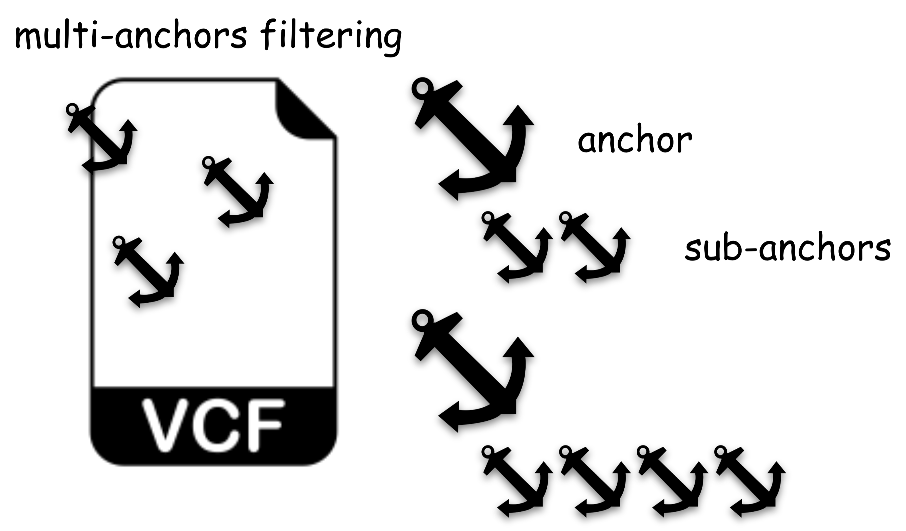

# vcf-filter



- multi-anchors filtering and multi-threads implementation for vcf filtering
    - for each `anchor` can include several `sub-anchors`.
    - in singel anchor, `pass` if all sub-anchors satisfied.

## Prerequisite
* Python 3
* vcf
    * decomposed & normalized by [vt](https://genome.sph.umich.edu/wiki/Vt) or bcftools
    * annotated by annovar (.vcf, not .txt)

## Installation
``` shell
git clone https://github.com/shanghungshih/vcf-filter.git
```

## Parameters
- `-v` `--vcfs` : the vcfs file which seperate by ','
- `-a` `--anchors` :  the information of the counters
- `-t` `--thread` :  pool size for multi-thread importing (default: 1)
- `--write2file` : `to be update`

## Quick start
1. without write2file
```
python3 vcf-filter.py -v sample1.hg19_multianno.vcf,sample2.hg19_multianno.vcf -a anchors/anchors-basic.json -t 2
```

2. with write2file
```
python3 vcf-filter.py -w true -v sample1.hg19_multianno.vcf,sample2.hg19_multianno.vcf -a anchors/anchors-PG-853variant.json
```


## anchors configuration
1. in anchors, define every `anchor name` which will show in results.
2. for each anchor, please define:
    - `key`: keys presents in info column of annovar-annotated vcf (ex. Func.refGene=TP53;AF=0.001;)
    - `type`: operator to perform comparison (valid types: `==`, `>=`, `<=`, `>`, `<`, `in`, `not in`)
    - `value`: operand to compare with vcf

## Notes
- count if variant pass all anchors
- for input file, only .vcf will be accepted.
- configure the anchors.json before you run the program, and make sure the key of each anchor appear in your vcf annotation.
- multi-threads is for multiple vcfs.

## example output (using `anchors/anchors-basic.json`)
- `total`: # of total variants
- `pass_anchors`: # of variants that pass all anchors

```
INFO     [vcf] : ['sample1.hg19_multianno.vcf', 'sample2.hg19_multianno.vcf']
INFO     [anchors file] : [anchors/anchors-basic.json]
INFO     [anchors] : ['anchors-PASS', 'anchors-AF<0.01', 'anchors-AF<0.05', 'anchors-PASS&AF<0.01', 'anchors-PASS&AF<0.05']
INFO     [write2file] : [False]
INFO     [threads] : [1]
INFO     [anchors-PASS]-[sample1.hg19_multianno.vcf] (time used: 0.00 min)
INFO     [total] : 20
INFO     [pass_anchors] : 0
INFO     [PASS] : 0
INFO
INFO     [anchors-PASS]-[sample2.hg19_multianno.vcf] (time used: 0.00 min)
INFO     [total] : 20
INFO     [pass_anchors] : 0
INFO     [PASS] : 0
INFO
INFO     [anchors-AF<0.01]-[sample1.hg19_multianno.vcf] (time used: 0.00 min)
INFO     [total] : 20
INFO     [pass_anchors] : 0
INFO     [AF<0.01] : 0
INFO
INFO     [anchors-AF<0.01]-[sample2.hg19_multianno.vcf] (time used: 0.00 min)
INFO     [total] : 20
INFO     [pass_anchors] : 0
INFO     [AF<0.01] : 0
INFO
INFO     [anchors-AF<0.05]-[sample1.hg19_multianno.vcf] (time used: 0.00 min)
INFO     [total] : 20
INFO     [pass_anchors] : 0
INFO     [AF<0.05] : 0
INFO
INFO     [anchors-AF<0.05]-[sample2.hg19_multianno.vcf] (time used: 0.00 min)
INFO     [total] : 20
INFO     [pass_anchors] : 0
INFO     [AF<0.05] : 0
INFO
INFO     [anchors-PASS&AF<0.01]-[sample1.hg19_multianno.vcf] (time used: 0.00 min)
INFO     [total] : 20
INFO     [pass_anchors] : 0
INFO     [PASS] : 0
INFO     [AF<0.01] : 0
INFO
INFO     [anchors-PASS&AF<0.01]-[sample2.hg19_multianno.vcf] (time used: 0.00 min)
INFO     [total] : 20
INFO     [pass_anchors] : 0
INFO     [PASS] : 0
INFO     [AF<0.01] : 0
INFO
INFO     [anchors-PASS&AF<0.05]-[sample1.hg19_multianno.vcf] (time used: 0.00 min)
INFO     [total] : 20
INFO     [pass_anchors] : 0
INFO     [PASS] : 0
INFO     [AF<0.05] : 0
INFO
INFO     [anchors-PASS&AF<0.05]-[sample2.hg19_multianno.vcf] (time used: 0.00 min)
INFO     [total] : 20
INFO     [pass_anchors] : 0
INFO     [PASS] : 0
INFO     [AF<0.05] : 0
INFO
```
